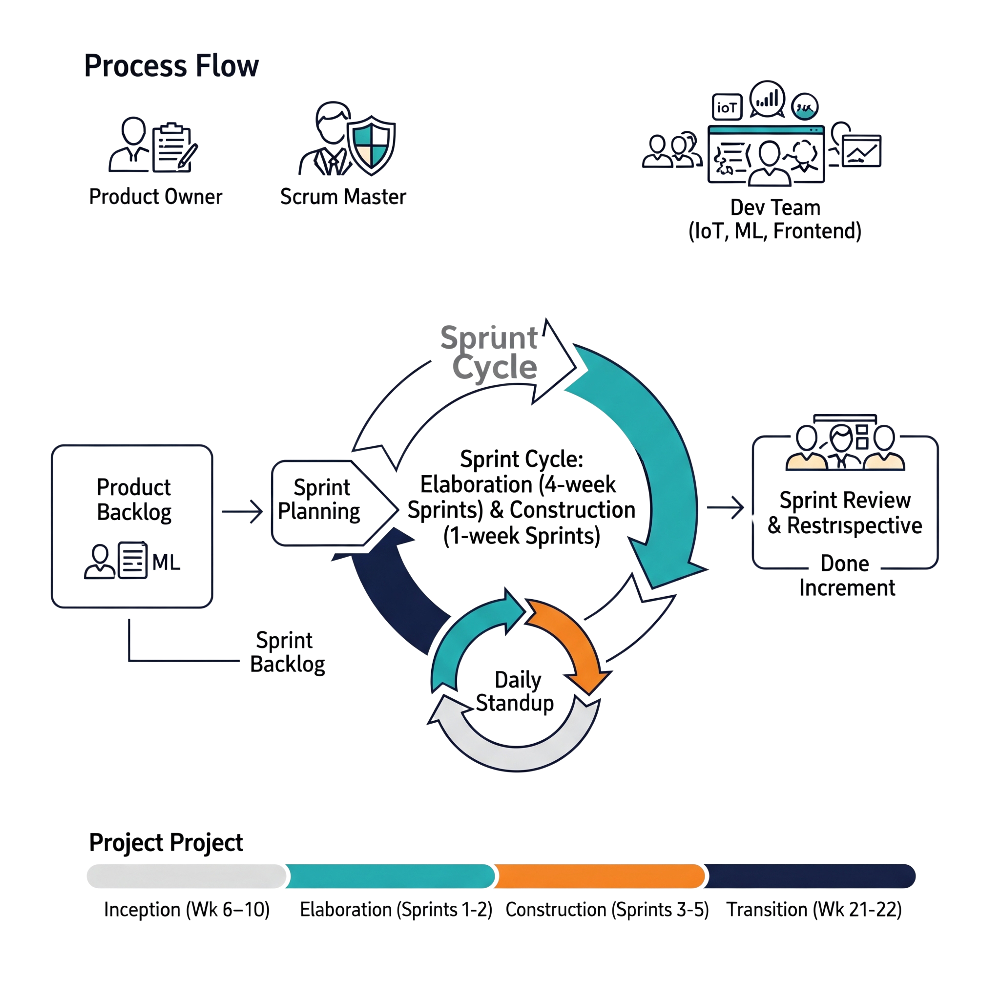
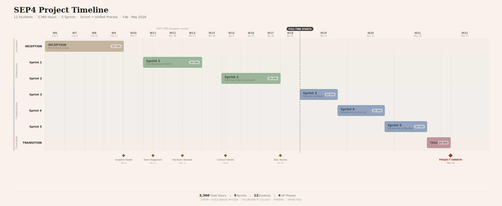

# Problem Domain

A study in 2024 done by the Fire Safety Journal found out that after three false alarms, residants' average evacuation time increase by 3.5 minutes. It migh seem harmless, but these extra minutes are often fatal in real fires. This is a long lasting problem in the industry that even though with all the new modern technoloy available it seems to never go away. 

Our client - Kamjatka, is a a student residency that have been accepting students since idk. One of the concerns of the residents is that the fire alarm is easily activated when doing routine actions such cooking, taking a hot shower, smoking. In some times these alarms when activated for a certain time can call the firefigheters without any assurance of real fire occurrence, leading to unecessary costs to both the resident and the resident manager.

One of the main catalyst for the need to change the fire detectors at Kamtjatka was the "microwave incident" last week when a fire detector went off  in a apartament where the residence used a microwave to heat up their food for five minutes, the minimal water vapor was enough to set up the alarm. The alarm was not deactivated in time, firefighters came and the resident had to pay 10000 DKK.The resident rightfully appealed it and the manager had to cover full costs. This type of redundacy not only created unecessary financial overhead for residents and /or manager,but also poses a serious life threat since residents are less affected by fire alarms due to its reapeating false alarms. 

The goal of this project is to create a client-server system and a more accurate fire detector for Kamtjatka that is both intuitive and functional. The application is supposed to handle monitoring of all the rooms in Kamtjatka while keeping the UI easy to track

## Air quality problem

## Current Situation

## Stakeholders

---

# Problem Statement

## Main problem:

How to provide easily accessible learning platform?

## Sub-questions:

---

# Delimitation

The project focuses on analyzing different parameters of a room to predict future CO2 levels and the amount of people inside. The system is intended to be free, aligning with our goal of making everyone able to know the quality of the air they are breathing. To ensure high-quality, accurate content, courses will be reviewed by experts and AI.

The project is limited to the development of a simple air quality prediction system for students, teachers, and its administrators. Features such as high-scale performance, complete accessibility, AI-based summaries, and enterprise-level security are not part of it.

Delimitations Related to Sub-questions

Security Security will be guaranteed on a low level (password hashing, simple role-based permissions). Advanced protection (multi-factor authentication) is beyond the project.

---

# Choice of Methods

## Knowledge and Data Collection

Environmental data (CO2, temperature, humidity) will be collected in real time through IoT sensors connected to an ATmega2560 microcontroller. Sensor readings are transmitted to a cloud backend and stored in a relational database for both live monitoring and historical analysis. This directly addresses the main problem of replacing subjective perception of air quality with continuous, objective measurement.

Literature on indoor environmental standards (WHO, 2010; Allen et al., 2016) will inform the thresholds used to classify air quality as "good" or "poor" and to trigger user notifications.

## Analysis and Modelling

UML diagrams (use case, class, sequence, component) will be used to model system functionality and interactions across the IoT, cloud, and frontend layers. Threat modelling will be conducted to identify security risks in authentication and data communication between embedded devices and the cloud.

Machine learning will be applied to sensor data for pattern detection and air quality prediction. The specific approach (classification, regression, or time series forecasting) will be selected during Elaboration once initial data characteristics are known. Python with standard libraries (pandas, scikit-learn) will be used for the ML pipeline.

## Design, Construction and Implementation

The system is developed as four components (to be revised):

| Component | Technology | Responsibility |
|-----------|-----------|----------------|
| IoT | Embedded C, ATmega2560 | Sensor reading, data buffering, actuator control, backend communication |
| Cloud/Backend | REST API, containers, Google Cloud Platform | Data ingestion, storage, business logic, notifications |
| Frontend | React | Dashboards, historical visualizations, alerts, responsive UI |
| ML | Python (pandas, scikit-learn) | Data preprocessing, model training, forecasts served via API |

All components communicate through interfacing contracts defined during Elaboration. Version control uses Git with GitHub (feature branching, pull requests). CI/CD pipelines automate building, testing, and deployment.

## Testing

Unit testing uses JUnit for backend components. API validation and integration testing uses Postman. The strategy combines white-box testing (internal code paths), grey-box testing (API integration points), and black-box testing (functional requirements). ML model performance is evaluated with metrics appropriate to the chosen approach. Automated regression tests run in the CI/CD pipeline via GitHub Actions.

## Planning and Management

The project follows Agile Unified Process (AUP) combined with Scrum (Schwaber & Sutherland, 2020). AUP provides the phase structure (Inception, Elaboration, Construction, Transition); Scrum provides the sprint-based iteration within those phases.

Each sub-team (IoT, ML, Frontend) operates as an independent Scrum team with its own Product Owner and Scrum Master. Cloud/Backend is a shared responsibility. Each team runs its own ceremonies: Sprint Planning, Daily Scrum, Sprint Review, and Sprint Retrospective. Cross-team coordination follows a Scrum-of-Scrums pattern where the three Scrum Masters meet to sync on blockers, integration status, and shared backlog items.

Task management uses a Kanban board (GitHub Projects). Documentation follows formal academic style with correct referencing. The full schedule is detailed in the Time Schedule section.

---

# Time Schedule

*Piotr, Christos*

The project runs from Weeks 6 to 22 (February 2 to May 28, 2026) and is divided into four Unified Process phases and five Scrum sprints.

**Inception** (Weeks 6–10) is a planning phase with no sprint. It formulates the group contract, the initial backlog, and the project description.

**Elaboration** has two part-time sprints: Sprint 1 (Weeks 11–14) is all about the architecture spike, setting up CI/CD, and getting used to the hardware. Sprint 2 (Weeks 15–18) gives you the interfacing contracts and a working vertical slice from sensor to cloud to frontend.

There are three full-time sprints (Sprints 3–5, Weeks 19–21) for **Construction**. These sprints focus on building features, testing integrations, and making the system more secure.

**Transition** (Weeks 21–22) is for finishing the report, the 30-minute video presentation, and the final deployment verification. The project is due on May 28.

The length of the sprint changes from four calendar weeks at part-time intensity during Elaboration to about five working days at full-time intensity during Construction. The overall budget is 3,360 hours, which comes out to 280 hours per student among 12 team members. About 10% of the time will be spent on Inception, 29% on Elaboration, 49% on Construction, and 12% on Transition, which is in line with the usual UP effort distribution.

#### Final Deadline

Date: May 28th 2026

### Project Timeline

| Date / Period            | Milestone / Activity             | Details |
|-----------------------|-------------------------------|--------------------|
| Every  Monday             | Weekly Reporting & Task Assignment | Submit progress report + assign new tasks |
| Weekly                    | Weekly Meeting                   | Checkpoint via Discord or at school |
| End of May 2026      | Completion of Formal Project Part | Finish writing & documentation for review |
| May 28, 2026         | Final Deadline                   | Submission of full project |

#### Milestones

1. **Weekly Reporting and Task Assignment**  
   When: Every Monday  
   Details: Submit a weekly report on the project’s progress and assign new tasks for the upcoming week to maintain continuous progress and team accountability.

2. **Weekly Meeting**  
   When: Once per week  
   Platform: Meetings will be conducted either via Discord or at school.  
   Purpose: These meetings will act as checkpoints to discuss progress, address challenges, and adjust tasks as necessary.

3. **Completion of Formal Project Part**  
   Target Date: End of May 2026  
   Details: Aim to complete the formal writing and documentation aspect by this date, allowing time for final revisions before the deadline.

### Total Hours Calculation for 10 ECTS

- Total Hours: 280 hours per student

---

# Risk Assessment

| Risk | Likelihood | Severity | Normalized | Preventive Actions |
|-----------|:--------:|:------:|:---------:|-----------------|
| Inexperienced team members on the technologies used | 3 | 5 | 15 | Offer help in guidance if needed Such team members might be advised to review the content taught in the semester. |
| Poor workload estimation during sprints | 2 | 3 | 6 | Prioritize key requirements that are necessary for the project to work. |
| Technical issues during system development | 4 | 3 | 12 | Set aside moments to check if systems work as they should and fix what does not. |
| The system has poor visual design | 5 | 2 | 10 | Define and enforce a cohesive design style, conduct user feedback sessions to refine and ensure a user-friendly visual layout.|
| lack of coordination between sub-groups | 5 |4 | 20 | Be srict with with setting up at least one meeting a week so everyone is updated on the overall project's progress and current state.|

# Summary of Risk Assessment

This risk assessment highlights several key factors that could disrupt the project. The highest risk score is associated with lack of coordination between sub-groups. 

---

# References

