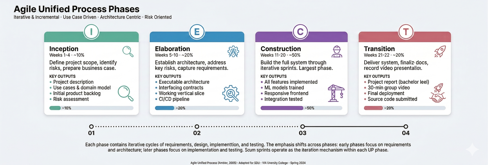
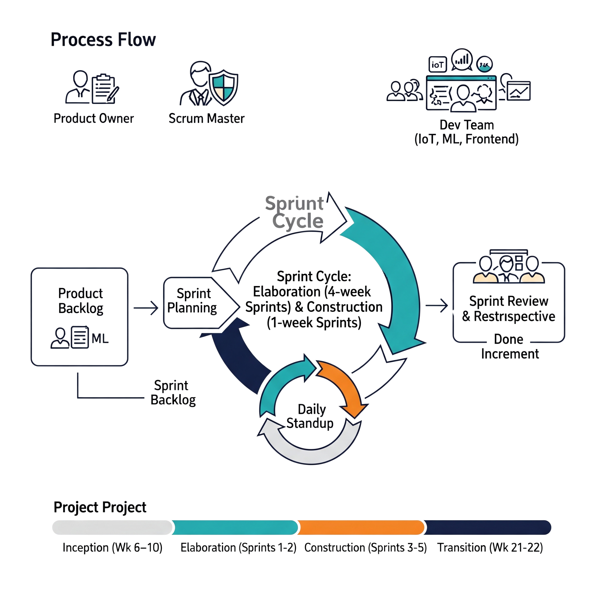
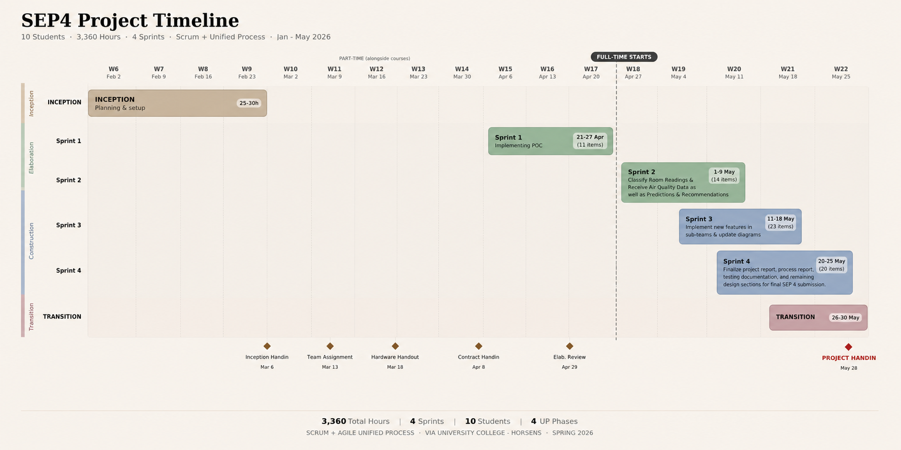

# Problem Domain

A study in 2024 done by the Fire Safety Journal found out that after three false alarms, residants' average evacuation time increase by 3.5 minutes. It might seem harmless, but these extra minutes are often fatal in real fires. This is a long lasting problem in the industry that even though with all the new modern technoloy available it seems to never go away. (https://www.phscompliance.co.uk/news/how-to-prevent-false-alarms-from-fire-alarm-systems-in-homes-and-offices/)

Fire safety systems are essential for protecting residents and buildings from dangerous fire incidents. However, traditional fire alarm systems in residential environments often suffer from false alarms caused by everyday activities such as cooking, steam from showers, or temporary air-quality changes. Frequent false alarms may reduce trust in the alarm system and cause residents to react more slowly during real emergencies.

Research has shown that repeated nuisance alarms can negatively affect how people respond during real emergencies. A study discussing occupant complacency and evacuation behaviour found that repeated alarms can reduce urgency and delay evacuation response times.

Additional fire-safety guidance also highlights that repeated false alarms in residential and workplace environments can create alarm fatigue, causing residents to take alarms less seriously over time.

Our client, Kamtjatka Student Residence, has experienced several incidents where the current fire alarm system was triggered unnecessarily. One example was the “microwave incident,” where heating food created enough vapor to activate the fire alarm. Because the alarm was not disabled in time, emergency services were contacted unnecessarily, resulting in financial costs and frustration for both residents and management.

The AeroSense project aims to develop a smart fire-risk monitoring and environmental monitoring system capable of distinguishing between normal environmental conditions, cooking smoke, steam-related false alarms, and possible fire situations. The system combines IoT sensors, backend cloud services, machine learning, and a frontend dashboard to provide a more intelligent and informative monitoring solution.

Unlike traditional systems that rely on a single smoke threshold, AeroSense uses multiple environmental measurements such as temperature, humidity, CO₂, TVOC, eCO₂, and air-quality indicators to better understand room conditions and support smarter decision-making.

The project is also supported by research into indoor environmental monitoring and air-quality standards. The World Health Organization has published guidelines showing the importance of monitoring indoor pollutants and environmental conditions in enclosed spaces.

---

# Problem Statement

## Main problem:

How can Kamtjatka improve its fire monitoring and fire-risk detection system to better identify dangerous fire situations while reducing unnecessary alarms caused by normal daily activities such as cooking or steam?

## Sub-questions:

1. What are the biggest limitations of the current fire alarm solution used by Kamtjatka?

2. How can environmental sensor data improve fire-risk detection and air-quality monitoring?

3. How can different user roles such as Residents, Building Administrators, and System Administrators interact with the system?

4. How can the system provide clear warnings, alerts, recommendations, and historical monitoring data?

5. How can we distinguish between normal conditions, cooking smoke, steam, and possible fire events?

---

# Delimitation

This project focuses on designing and implementing a prototype fire-risk monitoring and environmental monitoring system for the Kamtjatka student residence.

The system will collect environmental data using IoT sensors connected to an ATmega2560 microcontroller. Sensor data such as CO2, temperature, humidity, TVOC (Total Volatile Organic Compounds), eCO2 estimates, Air-quality indicators (AQI) will be transmitted to a cloud backend for storage and analysis.

Sensor data will be transmitted through WiFi and MQTT communication to a backend cloud system where the data will be stored, analysed, and processed.

Machine learning will be used to analyse sensor patterns and classify room conditions into categories such as: 

- Normal Conditions

- Cooking Smoke

- Steam/false alarm conditions

- Possible fire-risk conditions

However, the scope of this project is limited in several ways:

- The system will function as a prototype and decision-support solution and will not replace certified commercial fire alarm infrastructure.

- The project will not attempt to achieve commercial-grade fire safety certification.

- The deployment scope is limited to small-scale testing environments rather than full building deployment.

- Real fire-smoke generation will not be conducted by the project team due to safety concerns.

- Public datasets and controlled fire-smoke datasets will be used to support machine-learning training and evaluation.

- Advanced enterprise-level security mechanisms such as multi-factor authentication are outside the scope of the project.

- The system focuses on environmental monitoring and fire-risk prediction rather than direct emergency-service integration.

Research into machine-learning-based smoke detection systems supports the use of multi-sensor environmental monitoring combined with classification algorithms to distinguish between dangerous and non-dangerous environmental conditions.

## Delimitations Related to Sub-questions

### Fire-risk detection and classification

The project will investigate how environmental sensor data and machine learning can help distinguish between normal air conditions, cooking smoke, steam, and possible fire conditions. However, the system will not attempt to replace certified fire detection systems or guarantee perfect prediction accuracy.

### Monitoring and dashboard functionality

The project will support basic monitoring functionality for Residents, Building Administrators, and System Administrators. Large-scale building-management integration is outside the scope of the project.

### Security

Basic security mechanisms such as password hashing, authentication, authorization, and role-based access control will be implemented. Enterprise-grade security solutions are outside the scope of the project.

---

# Choice of Methods

## Knowledge and Data Collection

Environmental data (CO2, eCO2, temperature, humidity, TVOC, AQI) will be collected in real time through IoT sensors connected to an ATmega2560 microcontroller. Sensor readings are transmitted to a cloud backend and stored in a relational database for both live monitoring and historical analysis. This directly addresses the main problem of replacing subjective perception of air quality with continuous, objective measurement.

Sensor measurements will be transmitted using WiFi and MQTT communication to backend services where the data will be stored and analysed.

The project will collect data from different environmental situations including:

- Normal room conditions
- Cooking-related smoke or fumes
- Steam and humidity-heavy conditions

To safely support fire-related machine-learning training and evaluation, external datasets from public and institutional sources such as Kaggle will also be used.

One example is the public Smoke Detection Dataset available on Kaggle, which contains environmental measurements from indoor gas-fire scenarios, firefighter training areas, outdoor grills, and high-humidity environments.

Scientific literature and environmental standards will be used to support threshold values and evaluation criteria related to indoor air quality and fire-risk monitoring.

## Analysis and Modelling

UML diagrams (use case, class, sequence, component) will be used to model system functionality and interactions across the IoT, cloud, and frontend layers. Threat modelling will be conducted to identify security risks in authentication and data communication between embedded devices and the cloud.

User stories, functional requirements, and non-functional requirements will be created to define the expected behaviour of the system.

Research into advanced machine-learning fire detection systems demonstrates that combining multiple environmental sensors with classification algorithms can improve smoke and fire classification performance.

Machine learning will be applied to sensor data for pattern detection and air quality prediction. The specific approach (classification, regression, or time series forecasting) will be selected during Elaboration once initial data characteristics are known. Python with standard libraries (pandas, scikit-learn) will be used for the ML pipeline.

## Design, Construction and Implementation

The system is developed as four components (to be revised):

| Component | Technology | Responsibility |
|-----------|-----------|----------------|
| IoT | Embedded C, ATmega2560 | Sensor reading, data buffering, actuator control, backend communication |
| Cloud/Backend | REST API, containers, Google Cloud Platform | Data ingestion, storage, business logic, notifications |
| Frontend | React | Dashboards, historical visualizations, alerts, responsive UI |
| ML | Python (pandas, scikit-learn) | Data preprocessing, model training, forecasts served via API |

All components communicate through interfacing contracts defined during Elaboration. Version control uses Git with GitHub (feature branching, pull requests). CI/CD pipelines automate building, testing, and deployment.

## Testing

Testing will be performed continuously throughout the project.

The testing strategy will include:

- Unit testing

- Integration testing

- API testing

- Hardware testing

- System testing

- Regression testing

Different testing approaches will be used:

- White-box testing

- Grey-box testing

- Black-box testing

Backend APIs will be tested using Postman.

IoT testing will focus on:

- Sensor accuracy

- Payload generation

- MQTT communication

- Device stability

- WiFi connectivity

Machine-learning evaluation will focus on:

- Classification accuracy

- Prediction reliability

- False-positive and false-negative behaviour

Frontend testing will focus on:

- Dashboard usability

- Responsiveness

- Correct alert presentation

Automated testing will run through CI/CD pipelines using GitHub Actions.

## Planning and Management

The project follows Agile Unified Process (AUP) combined with Scrum (Schwaber & Sutherland, 2020). AUP provides the phase structure (Inception, Elaboration, Construction, Transition); Scrum provides the sprint-based iteration within those phases.

Each sub-team (IoT, ML, Frontend) operates as an independent Scrum team with its own Product Owner and Scrum Master. Cloud/Backend is a shared responsibility. Each team runs its own ceremonies: Sprint Planning, Daily Scrum, Sprint Review, and Sprint Retrospective. Cross-team coordination follows a Scrum-of-Scrums pattern where the three Scrum Masters meet to sync on blockers, integration status, and shared backlog items.

Task management uses a Kanban board (GitHub Projects). Documentation follows formal academic style with correct referencing. The full schedule is detailed in the Time Schedule section.

---

# Time Schedule

The project runs from Weeks 6 to 22 (February 2 to May 28, 2026) and is divided into four Unified Process phases and five Scrum sprints.

**Inception** (Weeks 6–10) is a planning phase with no sprint. It formulates the group contract, the initial backlog, and the project description.

**Elaboration** has two part-time sprints: Sprint 1 (Weeks 11–14) is all about the architecture spike, setting up CI/CD, and getting used to the hardware. Sprint 2 (Weeks 15–18) gives you the interfacing contracts and a working vertical slice from sensor to cloud to frontend.

There are three full-time sprints (Sprints 3–5, Weeks 19–21) for **Construction**. These sprints focus on building features, testing integrations, and making the system more secure.

**Transition** (Weeks 21–22) is for finishing the report, the 30-minute video presentation, and the final deployment verification. The project is due on May 28.

The length of the sprint changes from four calendar weeks at part-time intensity during Elaboration to about five working days at full-time intensity during Construction. The overall budget is 2,800 hours, which comes out to 280 hours per student among 10 team members. About 10% of the time will be spent on Inception, 29% on Elaboration, 49% on Construction, and 12% on Transition, which is in line with the usual UP effort distribution.

#### Final Deadline

Date: May 28th 2026

### Project Timeline

| Date / Period            | Milestone / Activity             | Details |
|-----------------------|-------------------------------|--------------------|
| Every  Monday             | Weekly Reporting & Task Assignment | Submit progress report + assign new tasks |
| Weekly                    | Weekly Meeting                   | Checkpoint via Discord or at school |
| End of May 2026      | Completion of Formal Project Part | Finish writing & documentation for review |
| May 28, 2026         | Final Deadline                   | Submission of full project |

#### Milestones

1. **Weekly Reporting and Task Assignment**  
   When: Every Monday  
   Details: Submit a weekly report on the project’s progress and assign new tasks for the upcoming week to maintain continuous progress and team accountability.

2. **Weekly Meeting**  
   When: Once per week  
   Platform: Meetings will be conducted either via Discord or at school.  
   Purpose: These meetings will act as checkpoints to discuss progress, address challenges, and adjust tasks as necessary.

3. **Completion of Formal Project Part**  
   Target Date: End of May 2026  
   Details: Aim to complete the formal writing and documentation aspect by this date, allowing time for final revisions before the deadline.

### Total Hours Calculation for 10 ECTS

- Total Hours: 280 hours per student

---

# Risk Assessment
 
## IoT Team Risks
 
| Risk ID | Risk | Probability | Impact | Score | What We'll Do About It | Owner |
|---------|------|-------------|--------|-------|------------------------|-------|
| R001 | Team members not familiar with ATmega2560 and embedded C | Medium | High | 15 | Pair with experienced members; workshops on the hardware early | IoT Lead |
| R003 | Hardware breaks or sensors stop working | High | High | 12 | Test hardware in Week 11; keep spare sensors; debug issues as they come up | IoT Lead |
| R014 | Sensors don't talk to the cloud properly | High | High | 16 | **CRITICAL** - Test connection early and often; log all data transfers; work closely with Backend | IoT Lead |
 
---
 
## Backend Team Risks
 
| Risk ID | Risk | Probability | Impact | Score | What We'll Do About It | Owner |
|---------|------|-------------|--------|-------|------------------------|-------|
| R006 | ML model predictions aren't accurate enough | Medium | High | 12 | Collect real sensor data early; test predictions; retrain the model if needed | Backend Lead |
| R007 | Security issues or data leaks | Medium | High | 12 | Add password hashing and access controls; test for vulnerabilities; limit what data we store | Backend Lead |
| R008 | Cloud service goes down or takes forever to set up | Medium | Medium | 9 | Get GCP running in Week 11; test services before we rely on them | Backend Lead |
| R009 | Database structure doesn't match what we actually need | Low | Medium | 6 | Plan the database carefully in Elaboration; review with the team before building | Backend Lead |
| R010 | Bugs slip through and break stuff in live system | Medium | High | 12 | Write tests early; use automated testing in the pipeline; catch bugs before deployment | Backend Lead |
| R014 | Sensors don't talk to the cloud properly | High | High | 16 | **CRITICAL** - Clear API contract with IoT team; log everything; integrate and test early | Backend Lead |
 
---
 
## Frontend Team Risks
 
| Risk ID | Risk | Probability | Impact | Score | What We'll Do About It | Owner |
|---------|------|-------------|--------|-------|------------------------|-------|
| R001 | Team members not familiar with React | Medium | High | 15 | Pair with experienced React devs; do workshops early; use tutorials if needed | Frontend Lead |
| R004 | Dashboard looks ugly or is hard to use | High | Low | 10 | Design with users in mind; get feedback from residents and managers; iterate | Frontend Lead |
| R010 | Bugs slip through and break stuff in live system | Medium | High | 12 | Test the UI thoroughly; use automated tests; catch bugs early | Frontend Lead |
 
---
 
## Shared / Project-Wide Risks
 
| Risk ID | Risk | Probability | Impact | Score | What We'll Do About It | Owner |
|---------|------|-------------|--------|-------|------------------------|-------|
| R002 | We estimate tasks wrong and run out of time | Low | Medium | 6 | Use past sprint data to estimate better; focus on must-haves first | - |
| R005 | Teams working on different parts don't talk to each other | High | High | 20 | **MOST CRITICAL** - Weekly meetings between teams every Monday; shared task board | - |
| R011 | Client isn't happy with what we're building | Low | High | 8 | Show demos regularly; ask for feedback; keep them updated | - |
| R012 | Requirements keep changing and scope grows | Medium | High | 12 | Lock down scope in Week 10; manage feature requests carefully | - |
| R013 | Someone gets sick or has to miss sprints | Low | Medium | 6 | Document everything; cross-train team members | - |
| R015 | Nobody understands how the code works after we're done | Medium | Medium | 9 | Write comments while coding; keep docs updated; explain decisions | - |
 
 ---

### Summary of Risk Assessment

This risk assessment highlights several key factors that could disrupt the project. The highest risk score is associated with lack of coordination between sub-groups. 

---

# References

[1] World Health Organization, WHO Guidelines for Indoor Air Quality: Selected Pollutants, 2010.

[2] D. Gold, “Occupant complacency in workplace fire evacuations,” Humanities and Social Sciences Communications, 2024.

[3] PHS Compliance, “How to Prevent False Alarms from Fire Alarm Systems in Homes and Offices,” 2024.

[4] Özyurt et al., “Efficient detection of different fire scenarios or nuisance situations using machine learning and multi-sensor systems,” 2024.

[5] DeepContractor, “Smoke Detection Dataset,” Kaggle.

[6] “Optimizing Fire Safety: Reducing False Alarms Using Advanced Machine Learning Techniques,” arXiv, 2025.

[7] G. Proulx, “Response to Fire Alarms,” SFPE Magazine.

[8] M. Kobes et al., “Exit choice, pre-movement time and evacuation behaviour,” 2010.